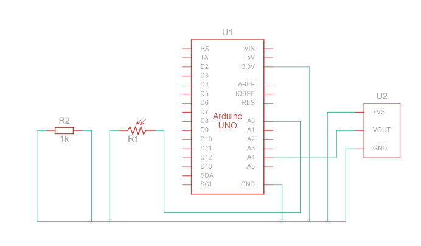

# NASA Internship Project 2023

## Overview

This code is designed to read temperature from a sensor, covert the reading to Celsius and Fahrenheit, display the temperature on the serial monitor, and blink the built-in LED on the Arduino every second.

The code has three main sections:

1. Global Declarations
2. The Setup Function
3. The Main Loop

### Global Declarations

We've set some basic settings for our temperature sensor and prepared a place to store its reading.

`#define aref_voltage 3.3`: Defines a constant named `aref_voltage`` with a value of `3.3``. This refers to the external reference voltage for the analog sensor.

`int tempPin = A1;`: This declares an integer named `tempPin` and assigns it a value of `A1`. 

`A1`` is one of the analog pins on the Arduino board and will be connected to the temperature sensor.

`int tempReading;`: Declares an integer named tempReading to store the raw analog reading from the temperature sensor.

### The Setup Function

We're setting up our Arduino to communicate with our computer, prepare the LED, and tell the Arduino where to get its reference voltage for readings.

`pinMode(LED_BUILTIN, OUTPUT);`: Sets the built-in LED on the Arduino board to output mode so we can control it (turn it on/off).

`Serial.begin(9600);`: Initializes the serial communication with a baud rate of `9600`, which means it'll send/receive data at a speed of 9600 bits per second.

`analogReference(EXTERNAL);`: Sets the analog reference voltage for the analog sensor to be the external reference, which is `aref_voltage` (`3.3V` in this case).

`Serial.print(...);`: Sends a welcome message to the serial monitor.

### The Main Loop

We continuously check the temperature sensor's reading.
We do some math to turn that reading into a temperature value.

We then display this temperature on our computer.
While doing this, we also make an LED light blink every second.

This is where the main actions happen repeatedly.

`tempReading = analogRead(tempPin);`: Reads the analog value from the temperature sensor and stores it in `tempReading`.

The following lines convert this analog reading into a voltage, then into Celsius and Fahrenheit temperature values.

`Serial.print(...);`: These lines display the reading, voltage, and temperatures in Celsius and Fahrenheit on the serial monitor.

The three `delay(1000);`` functions pause the code for 1 second each.

The `digitalWrite(...);` functions turn the built-in LED on and off, causing it to blink once every second.
